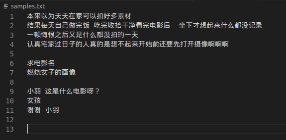

# 整理对话语料

* 两段文本之间用空行分开
* 不要表情等特殊字符，有标点

## 微博文本整理

1. 微博内容整理  
    对于大小号的微博正文，如图  
    

    整理为  

      
    直接整理为多句话  

2. 微博评论整理
    对于大小号的微博评论，整理有姜姜回复的评论，如图  
      
      
    如果被回复的人也回复了姜姜，就把最后的回复也加入，最终整理为
     
    
## 视频对话整理
1. 视频整理需要把上下文整理在一起，以下两个场景举例  
      
    整理为  
      
    正片的内容做同样的整理
      
    整理为  
    

## 整理内容

内容 | 整理人 | 得到文本数（行）
---- | ---- | ----
微博小号 | |
微博大号 | |
创造营正片 | |
创可 | |
片场日记+练习室日记 | |
微博视频采访 | |